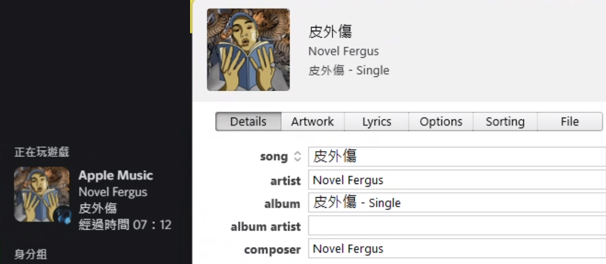

# Discord Apple Music Presence 

**Show what you listening to your discord friends**

## Album Artwork

*It's hard to find out the album artwork from the iTunes client itself*

According to [bendodson's iTunes Artwork Finder
](https://github.com/bendodson/itunes-artwork-finder "bendodson's iTunes Artwork Finder"), we can get search the album artwork by using the song name, album name and artist name. Thank you very much bendodson.

